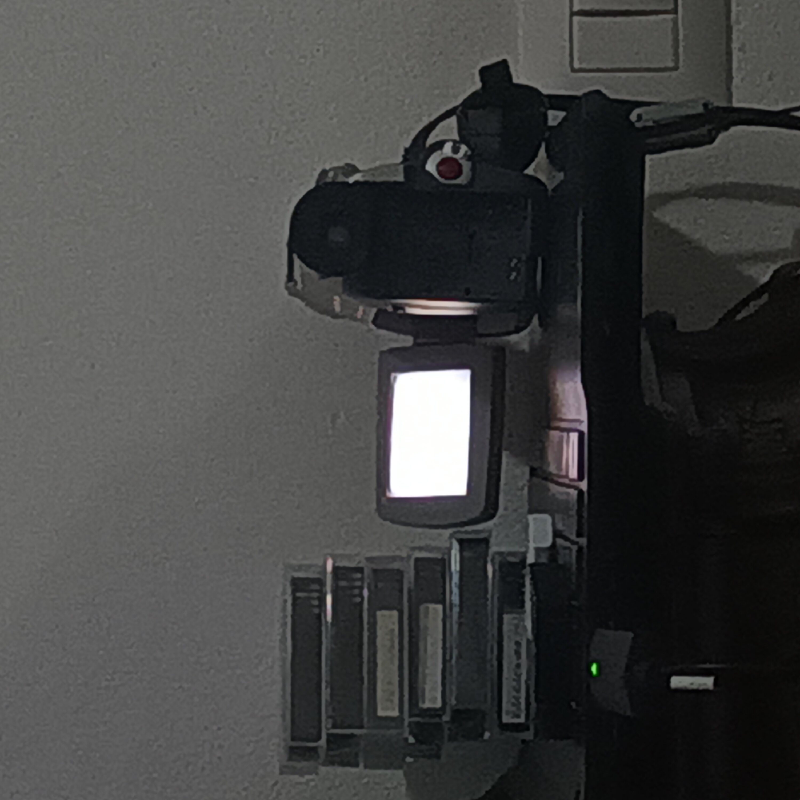

# Canon MV510

This digital camera is one of the first cameras I bought at a flea market, and the one I intend on keeping forever (or until its demise). Its a tape camera that takes MiniDV tape, making it pretty expensive to record with, although I plan to change that with a digital monitor with AV ports in the future, when I finally get the funds. Its screen is pretty burnt through, although this is to be expected, as it is from 2002, being 4 years older than me. I still have a lot of love for it though, because except for the screen, it is mostly intact. It works just fine with tapes, although sometimes has issues with certain tapes I have, but that hasnt stopped me from going through the 10s of tapes finding the ones that work, and the ones that ultimately dont. 

When I bought it, it came with an AV cable, its original charger, its original manual, and, surprisingly, its battery (fully functional!). I bought it with 2 other cameras at a flea market, and while not the first cameras I bought, they were definitively very memorable, especially the Canon MV510. I originally didnt have any tape to go along with the camera, so I was stuck using an AV to USB for a few weeks, until I flew to Italy, and found a whole bunch of MiniDV tapes in my attic. From there, I went through a few of them until I found one that I thought was suitable to record with, and thats what I did. I have so many clips of random stuff I recorded, because this camera was relatively convenient, I liked the image quality it produced, and it was genuinely fun to use. 

Being from 2002, its video quality isnt the peak of digital photography, but it compensates with a nostalgic feeling and great optical zoom. The screen, although small, is more than enough for recording, and its viewfinder is amazing, having adjustable focus, movable up to 90 degrees from its normal position, and it extends a few extra centimeters. The camera comes with a left and right speaker, the weird Canon proprietary controlling aux jack from the 2000s, a dedicated photo button, and a nice feeling zoom lever. For being so old, it has enough functionality to make it super enjoyable to use even in modern days. 

When it comes to most older digital cameras, their ancient media storage types usually hinder quite a bit due to having to find something that can record that medium to a modern standard, because while it is usually easy to aquire said medium, the real issue start at having to find something that can record that medium to a modern standard. Although, a cheap AV to USB device from the internet easily solves that with most cameras, especially this one. I have been not only using it for recording some stuff, but I have also been daily driving it as a microphone and a webcam. Not ideal, but it is a fun gimmick for the times I decide to turn on my camera in calls.

# Media
## Videos

Click the thumbnail below for the Youtube video that compiles some of the clips I took with this camera.

## GIFs

Apologies for the quality of the GIFs, had to compress them to Hell and back!

