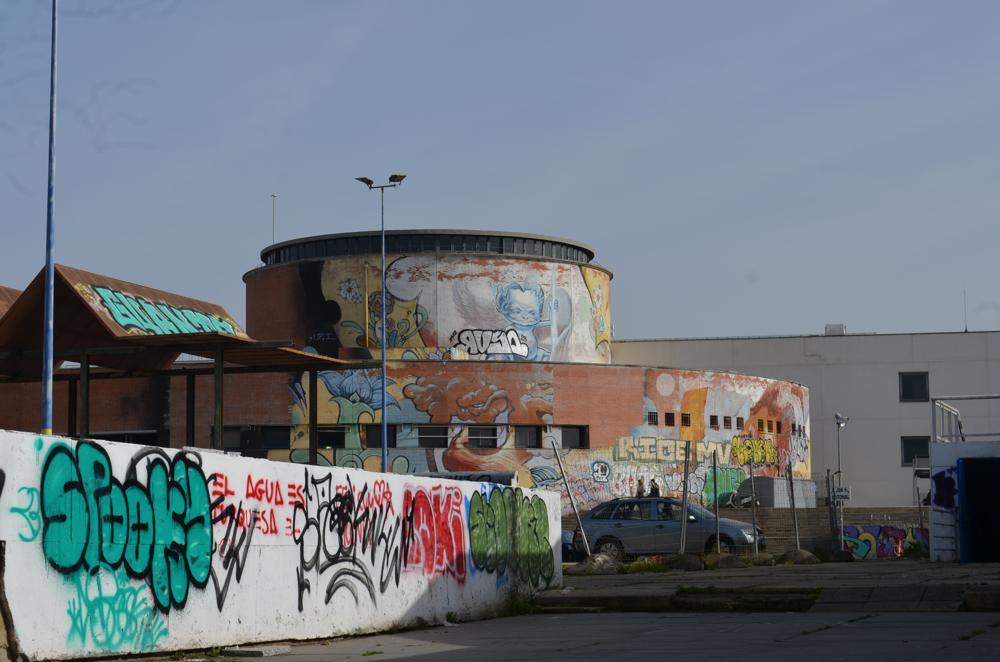
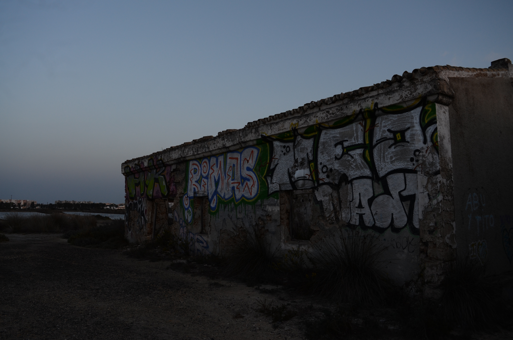
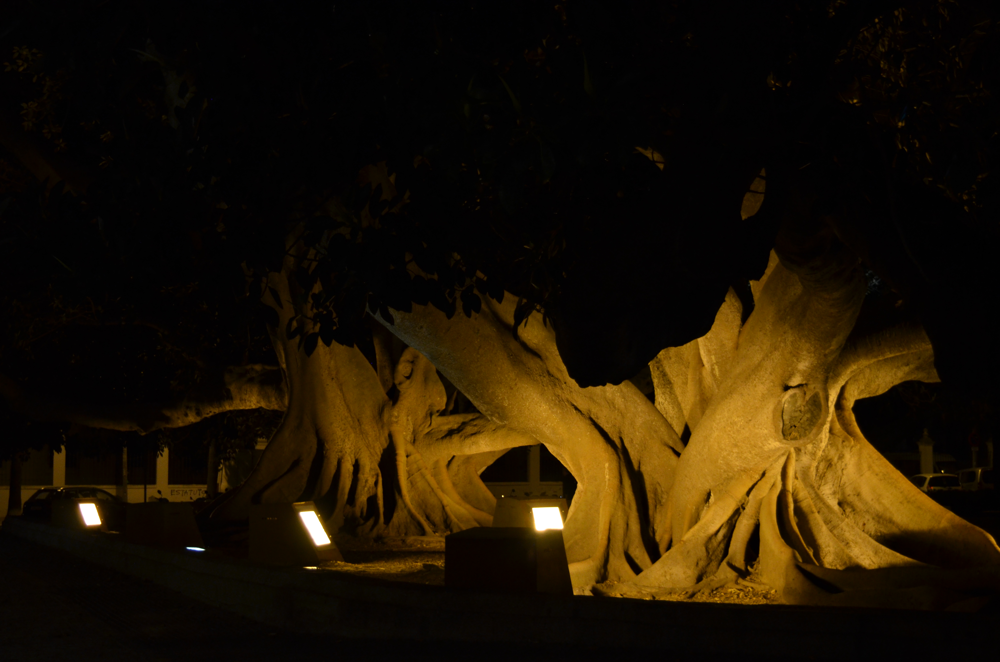
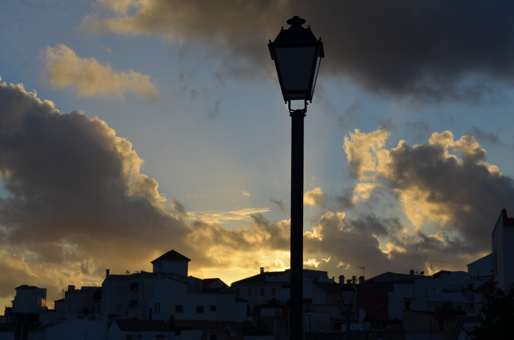

# Nikon D5100

One of two DSLRs gifted to me by my mother, this one which she inherited from my grandfather. Takes beautiful pictures, even with the lense that it came with by default, which doesnt immediately mean it takes bad photos, just takes a good photographer to take breathtaking photos. 

While my mom did gift me a newer model, I still stuck with this one, as it just felt better. No scientific backing behind this one, just love for the camera and its history. 

I shot plenty of photos with it, bringing it with me on most of my outings. Given that it takes the same battery as the D5300, I had two batteries, but that usually wasnt needed, as its battery usage was minimal. Only time this came in useful was in my couple day trip outside of my city, but I didnt drain the second battery much at all.

## Media

### Photos

